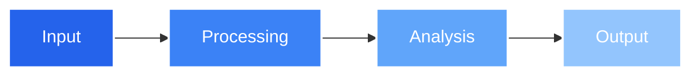

<div align="center">
  
  

  # 🌐 Domain Sentinel
  
  <h3>
    <strong>Next-Gen Domain Intelligence Platform</strong>
  </h3>

  [](https://golang.org/doc/go1.22)
  [](https://github.com/yourusername/domain-sentinel)
  [](https://github.com/yourusername/domain-sentinel/stargazers)

  <br/>

  <a href="#-features">Features</a> •
  <a href="#-quickstart">Quickstart</a> •
  <a href="#-docs">Docs</a> •
  <a href="#-community">Community</a>

</div>

<br/>

<div align="center">
  
  <br/>
  <br/>
</div>

## ⚡️ Features

<div align="center">
  <table>
    <tr>
      <td align="center">
        
        <br/>
        Real-time Monitoring
      </td>
      <td align="center">
        
        <br/>
        Pattern Detection
      </td>
      <td align="center">
        
        <br/>
        Visual Analytics
      </td>
      <td align="center">
        
        <br/>
        Threat Detection
      </td>
    </tr>
  </table>
</div>

## 🚀 Quickstart

```bash
# 🔥 One-line installation
curl -sSL https://get.domain-sentinel.dev | bash

# 🎮 Or manual setup
git clone https://github.com/yourusername/domain-sentinel.git
cd domain-sentinel && make install
```

## 🎯 Key Features

- 🔄 **Real-time Domain Intelligence**
  ```
  • Live domain registration tracking
  • Instant removal detection
  • Automated health monitoring
  ```

- 🧬 **Advanced Pattern Analysis**
  ```
  • ML-powered similarity detection
  • Configurable matching thresholds
  • Visual pattern mapping
  ```

- 📊 **Interactive Analytics**
  ```
  • Dynamic data visualization
  • Real-time statistical analysis
  • Custom reporting dashboards
  ```

## 🛠 Tech Stack

<div align="center">
  
</div>

## 📈 Performance



## 🌍 Community & Support

<div align="center">
  <a href="https://discord.gg/domain-sentinel">
    
  </a>
  <a href="https://twitter.com/domainsentinel">
    
  </a>
</div>

## 🤝 Contributors

<div align="center">
  <a href="https://github.com/0rx1/DomainMon/graphs/contributors">
    
  </a>
</div>

<div align="center">

## 💫 Star History

[](https://star-history.com/#0rx1/DomainMon&Date)

</div>

---

<div align="center">
  <strong>Domain Sentinel</strong> • Built with 💙 by <a href="https://github.com/0rx1">@0rx1</a>
  <br/>
  🌟 Star us on GitHub • 🐛 Report an Issue
</div> 
