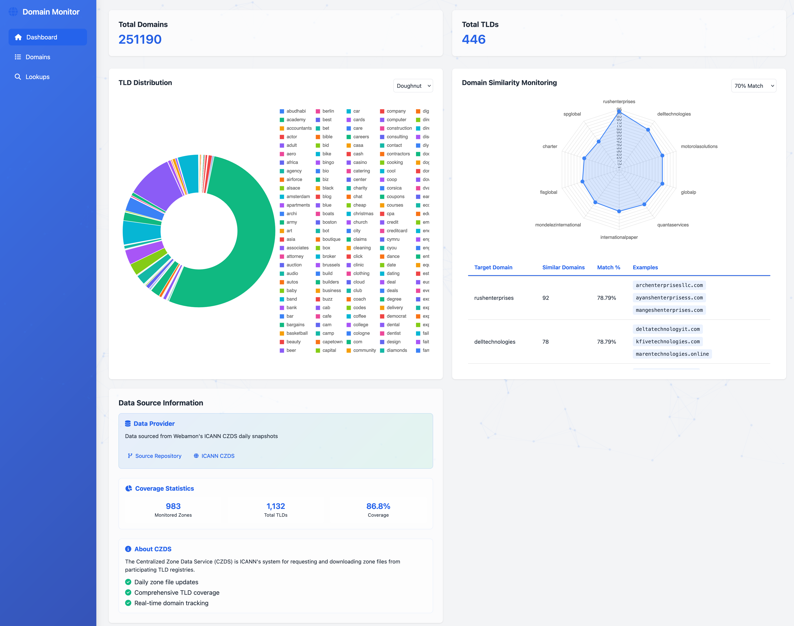

<div align="center">
  

  # DomainMon
  > Simple Domain Analysis Dashboard

  [](https://go.dev)
  [](https://developer.mozilla.org)
  [](https://www.chartjs.org)
  [](LICENSE)
</div>

<div align="center">
  
</div>

<div align="center">
  <h2>✨ Features</h2>
  <kbd>
    <br>
    <span>
      📊 <b>TLD Analytics</b> &nbsp;•&nbsp;
      🔍 <b>Pattern Detection</b> &nbsp;•&nbsp;
      🎯 <b>Domain Search</b> &nbsp;•&nbsp;
      ⚡ <b>Fast Lookups</b>
    </span>
    <br>
    <br>
  </kbd>
</div>

## 🚀 API Endpoints

```go
// Domain Operations
GET /api/v1/domains         // List all domains with pagination
GET /api/v1/domains/new     // Get newly registered domains
GET /api/v1/domains/stats   // Get domain statistics

// TLD Analysis
GET /api/v1/tlds           // Get TLD distribution
GET /api/v1/tlds/{tld}     // Get specific TLD details

// Domain Lookups
GET /api/v1/lookup/whois   // WHOIS information lookup
GET /api/v1/lookup/dns     // DNS records lookup
```

## 🔄 Data Source

Powered by [Webamon's ICANN CZDS Daily Snapshots](https://codeberg.org/webamon/newly_registered_domains):
- Daily updates of newly registered domains
- Fortune 500 domain similarity monitoring
- Comprehensive TLD coverage

## 💫 Core Features

<div align="center">
  <table>
    <tr>
      <td align="center">
        <h3>📈</h3>
        <b>Analytics</b>
        <p>TLD Distribution</p>
      </td>
      <td align="center">
        <h3>🔄</h3>
        <b>Lookups</b>
        <p>WHOIS & DNS</p>
      </td>
      <td align="center">
        <h3>🎯</h3>
        <b>Patterns</b>
        <p>F500 Analysis</p>
      </td>
      <td align="center">
        <h3>⚡</h3>
        <b>Performance</b>
        <p>Smart Caching</p>
      </td>
    </tr>
  </table>
</div>

## 🚀 Quick Start

```bash
git clone https://github.com/0rx1/DomainMon.git && cd domain-sentinel
go mod tidy
go run .
```

<div align="center">
  <br>
  <p>
    <a href="https://www.linkedin.com/company/web-a-mon">
      
    </a>
    <a href="https://www.linkedin.com/in/charafeddine-nassiri">
      
    </a>
  </p>
  <p>Made with 💙</p>
</div>


## 📜 License

```
Copyright 2024 Domain Sentinel Contributors

Licensed under the Apache License, Version 2.0 (the "License");
you may not use this file except in compliance with the License.
You may obtain a copy of the License at

    http://www.apache.org/licenses/LICENSE-2.0

Unless required by applicable law or agreed to in writing, software
distributed under the License is distributed on an "AS IS" BASIS,
WITHOUT WARRANTIES OR CONDITIONS OF ANY KIND, either express or implied.
See the License for the specific language governing permissions and
limitations under the License.
```

This project is licensed under the Apache License, Version 2.0. See the [LICENSE](LICENSE) file for the full license text. 
